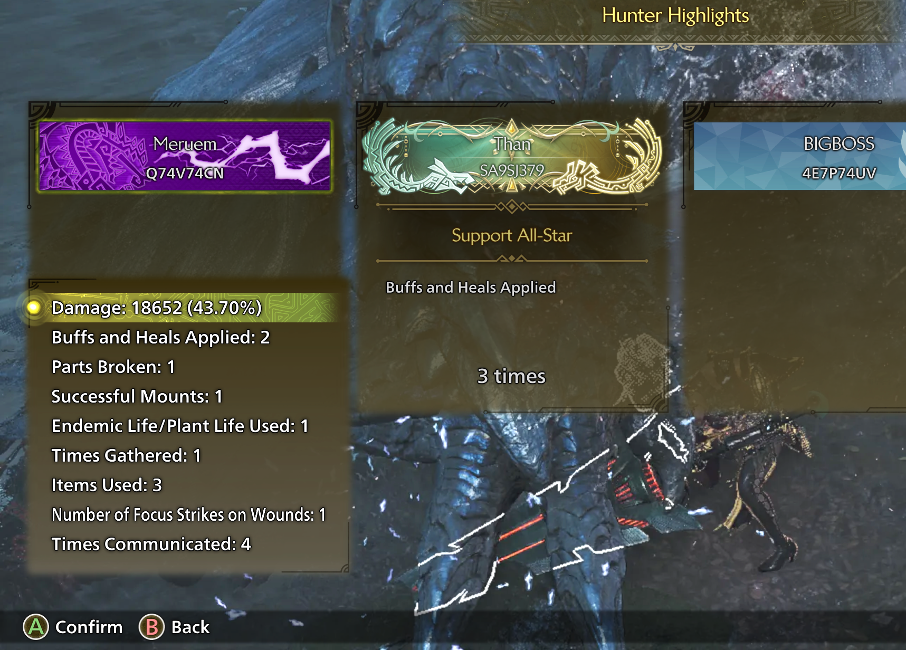
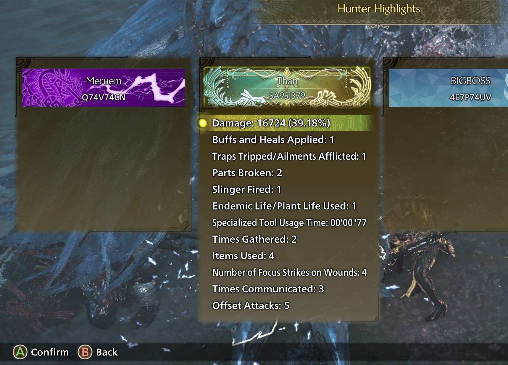
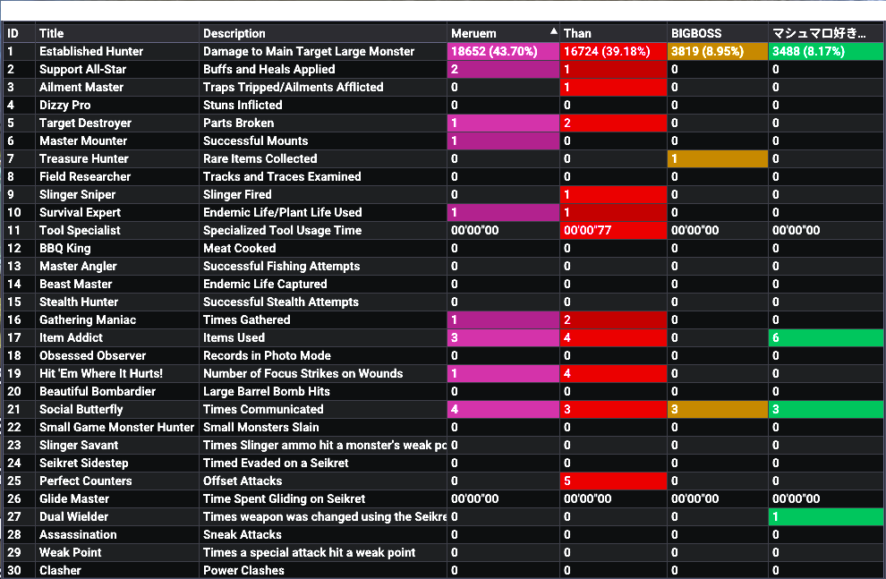

# Better Hunter Highlights - Monster Hunter Wilds Mod

> [!WARNING]
> The "Support All-Star | Buffs and Heals Applied" highlight is currently not working and set to 0.

## Features
- REFramework UI table with detailed Hunter Highlight information
- Hunter Highlights added to the quest result sub menus
- Option to hide the damage numbers (Reward 'Established Hunter')

## Requirements
- Requires [REFramework](https://www.nexusmods.com/monsterhunterwilds/mods/93)

## Installation
- Make sure the `better_hunter_highlights.lua` script is in `reframework/autorun` directory

## Submenu

## Table

